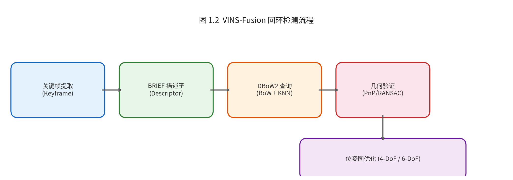

# 回环检测数学模型与 Pose Graph 复用机制

> 本文档说明 VINS-Fusion-ROS2 中 Loop Fusion 模块的回环检测原理、位姿图优化数学模型，以及 `load_previous_pose_graph: 1` 时历史 Pose Graph 对第二次运行的影响机制。

---

## 1. 回环检测概述

### 1.1 为什么需要回环检测

视觉惯性里程计（VIO）前端通过滑动窗口优化和边缘化，累积误差不可避免。长时间运行后，轨迹会产生**漂移**（drift）。当相机回到曾经到过的位置时，如果能检测到这一事件（回环），就可以通过全局位姿图优化将历史轨迹"拉"回正确位置，消除累积误差。

### 1.2 VINS-Fusion 回环检测流程



---

## 2. DBoW2 词袋模型

### 2.1 BRIEF 描述子

VINS-Fusion 使用 **BRIEF**（Binary Robust Independent Elementary Features）描述子，每个特征点生成一个 256 位的二进制串。相比 SIFT/SURF，BRIEF 的优势是：

- **计算极快**：仅比较像素灰度，无浮点运算
- **存储紧凑**：256 bit = 32 字节
- **匹配高效**：用 Hamming 距离（异或+popcount）替代 L2 距离

描述子生成时，VINS-Fusion 使用预训练的 `brief_pattern.yml` 中定义的像素对模式，确保跨运行的一致性。

### 2.2 视觉词袋 (Visual Vocabulary)

离线训练阶段，将大量 BRIEF 描述子用 **k-means++** 聚类成 **$k=10$ 层、每层 $L=6$ 分支**的树状词典（vocabulary tree），共 $10^6$ 个叶节点（words）。每个 word 对应一个聚类中心。

在线查询时，关键帧的描述子逐层遍历树，落入对应的叶节点，形成该帧的 **Bag-of-Words 向量**：

$$
\mathbf{v}_i = [w_1, w_2, \dots, w_N], \quad N = 10^6
$$

其中 $w_j$ 是 TF-IDF 权重：

$$
w_j = \frac{n_{ij}}{n_i} \cdot \log\frac{M}{m_j}
$$

- $n_{ij}$：帧 $i$ 中属于 word $j$ 的特征数
- $n_i$：帧 $i$ 的总特征数
- $M$：总关键帧数
- $m_j$：包含 word $j$ 的关键帧数

### 2.3 关键帧数据库

所有历史关键帧的 BoW 向量存入 **Inverted File Index**（倒排索引）。查询当前帧时：

1. 计算当前帧的 BoW 向量 $\mathbf{v}_q$
2. 遍历倒排索引，统计与当前帧共享 word 的历史帧
3. 用 **L1 范数** 计算相似度得分：

$$
s(i, q) = 1 - \frac{1}{2} \sum_{j=1}^{N} \left| w_j^{(i)} - w_j^{(q)} \right|
$$

4. 返回得分最高的 $K$ 个候选帧（通常 $K=5$）

---

## 3. 回环检测的数学模型

### 3.1 相似度评分与候选筛选

DBoW2 返回的候选帧需经过两级过滤：

**第一级：时间窗口过滤**
- 候选帧与当前帧的时间差必须大于阈值（避免连续帧误判）
- 通常要求 $|t_{cur} - t_{old}| > 15$ 秒

**第二级：连续一致性验证**
- 当前帧的最近 $N$ 帧中，至少有 $M$ 帧也匹配到同一历史区域
- 避免单帧误匹配导致的假回环

### 3.2 几何验证：EPnP + RANSAC

对通过词袋筛选的候选帧，进行特征点级的几何验证：

**Step 1：特征匹配**
- 当前帧与候选帧的 BRIEF 描述子做暴力匹配（Hamming 距离）
- 采用 **Lowe's ratio test** 筛选高质量匹配对

**Step 2：相对位姿估计**
- 使用 **EPnP**（Efficient Perspective-n-Point）算法，从 2D-3D 对应关系估计相对位姿
- 由于 VIO 已提供 3D 地图点，直接利用当前帧和候选帧的共同观测点

**Step 3：RANSAC 外点剔除**
- 用 PnP + RANSAC 剔除误匹配
- 内点数量 > 阈值（通常 30 个）才认为回环有效

**Step 4：相对位姿精修**
- 内点通过 **Huber 核函数** 加权，最小化重投影误差：

$$
\min_{\mathbf{R}, \mathbf{t}} \sum_{k} \rho_H \left( \left\| \mathbf{p}_k^{cur} - \pi\left(\mathbf{K}, \mathbf{R} \mathbf{P}_k + \mathbf{t}\right) \right\|^2 \right)
$$

其中 $\rho_H$ 是 Huber 核，$\pi(\cdot)$ 是投影函数。

### 3.3 回环边的信息矩阵

验证通过后，计算回环约束的 **信息矩阵**（权重）。信息矩阵与匹配特征点的几何分布有关：

- 特征点分布均匀 → 信息矩阵各向同性，权重高
- 特征点集中在小区域 → 某些方向约束弱，权重低

VINS-Fusion 中简化为固定权重 $\mathbf{\Lambda}_{loop}$。

---

## 4. 位姿图优化 (Pose Graph Optimization)

### 4.1 图结构

Pose Graph 是一个无向图 $G = (\mathcal{V}, \mathcal{E})$：

- **节点** $\mathcal{V} = \{\mathbf{T}_1, \mathbf{T}_2, \dots, \mathbf{T}_n\}$：每个关键帧的位姿（从世界系到机体系）
  - $\mathbf{T}_i = [\mathbf{R}_i \mid \mathbf{t}_i] \in SE(3)$

- **边** $\mathcal{E} = \mathcal{E}_{vio} \cup \mathcal{E}_{loop}$：
  - **VIO 边** $\mathcal{E}_{vio}$：相邻关键帧之间的相对位姿约束，来自 VIO 前端的滑动窗口输出
  - **回环边** $\mathcal{E}_{loop}$：回环匹配对之间的相对位姿约束

### 4.2 优化目标函数

位姿图优化的目标是找到一组位姿 $\{\mathbf{T}_i\}$，使得所有边的约束误差最小：

$$
\min_{\{\mathbf{T}_i\}} \sum_{(i,j) \in \mathcal{E}} \left\| \mathbf{e}_{ij} \right\|^2_{\mathbf{\Lambda}_{ij}}
$$

其中误差函数定义为：

$$
\mathbf{e}_{ij} = \log\left( \left(\mathbf{T}_i^{-1} \mathbf{T}_j\right)^{-1} \mathbf{\hat{T}}_{ij} \right)^\vee
$$

- $\mathbf{\hat{T}}_{ij}$：测量得到的相对位姿（VIO 或回环检测输出）
- $\mathbf{T}_i^{-1} \mathbf{T}_j$：当前估计的相对位姿
- $\log(\cdot)^\vee$：从 $SE(3)$ 到 $\mathfrak{se}(3)$ 的对数映射，即李代数误差
- $\|\mathbf{e}\|^2_{\mathbf{\Lambda}} = \mathbf{e}^T \mathbf{\Lambda} \mathbf{e}$：马氏距离

### 4.3 4-DoF vs 6-DoF 优化

VINS-Fusion 根据是否使用 IMU 选择优化维度：

**VIO 模式（`imu: 1`）：4-DoF 优化**
- 由于 IMU 提供了绝对重力方向（roll 和 pitch 可观测），只需优化 **x, y, z, yaw**
- 将位姿参数化为 $\mathbf{x}_i = [x_i, y_i, z_i, \psi_i]^T$
- 误差函数退化为 4 维：

$$
\mathbf{e}_{ij}^{(4)} = \begin{bmatrix} \mathbf{R}_{z}^T(-\psi_i)(\mathbf{t}_j - \mathbf{t}_i) - \hat{\mathbf{t}}_{ij} \\ \psi_j - \psi_i - \hat{\psi}_{ij} \end{bmatrix}
$$

**VO 模式（`imu: 0`）：6-DoF 优化**
- 纯视觉没有绝对姿态参考，需要优化完整的 $SE(3)$
- 使用 Ceres 的自动求导，参数化为四元数 + 平移

### 4.4 Ceres Solver 求解

VINS-Fusion 使用 **Ceres Solver** 的 **Levenberg-Marquardt** 算法求解：

```cpp
// loop_fusion/src/pose_graph.cpp:optimize6DoF()
// 或 optimize4DoF()
ceres::Problem problem;
for (each edge) {
    ceres::CostFunction* cost_function = 
        FourDOFError::Create(relative_t, relative_q, loop_info);
    problem.AddResidualBlock(cost_function, loss_function, 
                             sequence_array[i], sequence_array[j]);
}
ceres::Solve(options, &problem, &summary);
```

优化后，所有历史关键帧的位姿被全局修正，累积漂移被消除。

---

## 5. Pose Graph 复用：第二次运行的影响

### 5.1 核心问题：VIO World Frame 的差异

每次 VINS 初始化时，VIO World Frame 的 **Z 轴固定向上**（通过 `g2R(g)` 对齐重力），但 **X/Y 轴的方向完全取决于第一帧相机的朝向**。

| 运行次数 | 起始朝向 | World X/Y 方向 |
|---|---|---|
| 第一次 | 朝北 | X=东, Y=北 |
| 第二次 | 朝东 | X=南, Y=东 |

两个 World Frame 在水平面内可能相差任意角度（$0^\circ$ ~ $360^\circ$）。如果直接把第二次的轨迹叠加到第一次的地图上，两条轨迹在 RViz 中看起来会是"歪"的，无法拼接。

### 5.2 load_previous_pose_graph: 1 的工作流程

当 `load_previous_pose_graph: 1` 时，Loop Fusion 启动时会执行 `PoseGraph::loadPoseGraph()`：

**Step 1：加载历史关键帧**
```cpp
// loop_fusion/src/pose_graph.cpp:968
void PoseGraph::loadPoseGraph() {
    // 从 pose_graph.txt 读取所有历史关键帧的位姿
    // 从 *_briefdes.dat 读取 BRIEF 描述子
    // 从 *_keypoints.txt 读取特征点
}
```

**Step 2：重建词袋库**
```cpp
// loop_fusion/src/pose_graph.cpp:249
void PoseGraph::loadKeyFrame(KeyFrame* cur_kf, bool flag_detect_loop) {
    // flag_detect_loop = 0：不主动检测回环
    addKeyFrameIntoVoc(cur_kf);  // 但会加入 DBoW2 词袋库
}
```

历史关键帧被加载后，它们的 BRIEF 描述子进入 **Inverted File Index**。此时词袋库中同时包含第一次和第二次的关键帧（第二次运行时逐步添加）。

### 5.3 坐标系对齐机制：回环触发时

当第二次运行的新关键帧与第一次的历史关键帧**检测到回环**时，系统会自动对齐坐标系。

**触发条件：**
1. `detectLoop()` 返回非 -1 的候选帧索引（词袋相似度足够高）
2. `findConnection()` 几何验证通过（EPnP + RANSAC 内点 > 阈值）

**对齐计算**（`loop_fusion/src/pose_graph.cpp:111-155`）：

设新关键帧为 $cur$，匹配到的历史关键帧为 $old$。

从回环检测中得到相对位姿测量：
- $\hat{\mathbf{t}}_{rel}$：从 $old$ 到 $cur$ 的相对平移
- $\hat{\mathbf{R}}_{rel}$：从 $old$ 到 $cur$ 的相对旋转

计算 $cur$ 在**旧 World Frame** 中的位姿：

$$
\mathbf{P}_{cur}^{(old)} = \mathbf{R}_{old} \hat{\mathbf{t}}_{rel} + \mathbf{t}_{old}
$$

$$
\mathbf{R}_{cur}^{(old)} = \mathbf{R}_{old} \hat{\mathbf{R}}_{rel}
$$

而 $cur$ 的 VIO 位姿在**新 World Frame** 中为 $(\mathbf{P}_{cur}^{(new)}, \mathbf{R}_{cur}^{(new)})$。

**坐标系变换**（shift）：

对于 VIO 模式（`use_imu = 1`），由于 roll/pitch 已对齐（重力对齐），只需对齐 yaw：

$$
\delta\psi = \text{atan2}\left(\mathbf{R}_{cur}^{(old)} \mathbf{e}_1, \mathbf{R}_{cur}^{(old)} \mathbf{e}_2\right) - \text{atan2}\left(\mathbf{R}_{cur}^{(new)} \mathbf{e}_1, \mathbf{R}_{cur}^{(new)} \mathbf{e}_2\right)
$$

$$
\mathbf{R}_{shift} = \mathbf{R}_z(\delta\psi)
$$

对于 VO 模式（`use_imu = 0`），需要完整旋转对齐：

$$
\mathbf{R}_{shift} = \mathbf{R}_{cur}^{(old)} \left(\mathbf{R}_{cur}^{(new)}\right)^T
$$

平移对齐：

$$
\mathbf{t}_{shift} = \mathbf{P}_{cur}^{(old)} - \mathbf{R}_{shift} \mathbf{P}_{cur}^{(new)}
$$

**全局序列对齐：**

一旦计算出 $(\mathbf{R}_{shift}, \mathbf{t}_{shift})$，整个新序列的所有关键帧的 VIO 位姿都被变换到旧 World Frame：

```cpp
// loop_fusion/src/pose_graph.cpp:136-153
w_r_vio = shift_r;      // R_shift
w_t_vio = shift_t;      // t_shift

// 对新序列的所有关键帧应用变换
for (each keyframe in new_sequence) {
    vio_P = w_r_vio * vio_P + w_t_vio;
    vio_R = w_r_vio * vio_R;
    updateVioPose(vio_P, vio_R);
}
```

数学上，这等价于：

$$
\mathbf{T}_i^{(aligned)} = \begin{bmatrix} \mathbf{R}_{shift} \mathbf{R}_i^{(new)} & \mathbf{R}_{shift} \mathbf{t}_i^{(new)} + \mathbf{t}_{shift} \\ \mathbf{0}^T & 1 \end{bmatrix}
$$

对齐后，新序列的轨迹与旧序列共享同一个 World Frame，可以无缝拼接。

### 5.4 有区域重叠的情况

**场景**：第二次运行时，相机经过第一次跑过的房间/走廊。

**效果**：
1. 新关键帧的 BRIEF 描述子与历史关键帧在 DBoW2 中匹配
2. 几何验证通过，回环边被添加到 Pose Graph
3. 触发 `shift_r / shift_t` 计算，新序列坐标系自动对齐
4. 全局位姿图优化运行，第一次的漂移也被进一步修正

**输出特征**：
- Loop Fusion 终端输出：`X detect loop with Y`
- RViz 中 `/loop_fusion/pose_graph_path` 显示两条轨迹完美拼接

### 5.5 无区域重叠的情况

**场景**：第二次运行从完全不同的区域开始，且整个运行过程中没有经过第一次的区域。

**效果**：
1. 历史关键帧仍被加载到词袋库中
2. 新关键帧在 DBoW2 中查询时，**无法找到高相似度的历史候选帧**
3. `detectLoop()` 返回 -1，不触发回环
4. `shift_r / shift_t` 不被计算

**结果**：
- 新序列的轨迹完全存在于自己的 VIO World Frame 中
- 历史地图只是"备用参考"，不参与当前轨迹的修正
- RViz 中两条轨迹可能以不同朝向/位置显示，不会强制拼接

**这不是 bug，而是设计如此**。强制拼接没有几何约束的轨迹会导致错误的全局优化。

### 5.6 坐标原点是否混乱的深入分析

#### 5.6.1 用户常见疑问

> "第一次从 A 起飞建立 pose graph，第二次从 B 起飞，飞到 C 触发回环。回环对齐后，第二次的轨迹原点变成了 A 还是 B？位置会不会乱？"

**答案：不会乱，这是全局坐标系刚性拼接的正确行为。**

#### 5.6.2 坐标系变换的物理意义

回环对齐计算出的 $(\mathbf{R}_{shift}, \mathbf{t}_{shift})$ 是一个**刚性变换**（等距变换），它有如下性质：

1. **保持相对距离不变**：第二次轨迹中任意两点 $P_i, P_j$ 的欧氏距离在对齐前后不变
2. **保持角度不变**：轨迹的局部几何形状不改变
3. **仅做整体平移+旋转**：整个轨迹作为一个刚体被"搬运"到旧坐标系中

用数学语言描述：

设第二次轨迹上的两点 $P_i, P_j$ 在新 VIO 坐标系中的向量差为 $\Delta\mathbf{p} = \mathbf{p}_j - \mathbf{p}_i$。

对齐后：

$$
\mathbf{p}_j^{(aligned)} - \mathbf{p}_i^{(aligned)} = (\mathbf{R}_{shift}\mathbf{p}_j + \mathbf{t}_{shift}) - (\mathbf{R}_{shift}\mathbf{p}_i + \mathbf{t}_{shift}) = \mathbf{R}_{shift}(\mathbf{p}_j - \mathbf{p}_i) = \mathbf{R}_{shift} \Delta\mathbf{p}
$$

模长：

$$
\|\mathbf{p}_j^{(aligned)} - \mathbf{p}_i^{(aligned)}\| = \|\Delta\mathbf{p}\|
$$

**相对距离完全不变，只是整体被旋转了。**

#### 5.6.3 具体场景图示

```
第一次运行（保存 pose graph）:

        D ●────────────────────────● C
          │                         │
          │        旧坐标系           │
          │        (A = 原点)         │
        A ●────────────────────────●
         ↑
       起飞点 A  [0, 0, 0]

第二次运行（加载 pose graph，从 B 起飞）:

        B ●────────────────────────● C
          │                         │
          │      新 VIO 坐标系        │
          │      (B = 原点 [0,0,0])   │
          │                         │
          └─────────────────────────┘

对齐后（回环触发，新系 → 旧系）:

        A ●────────────────────────●
          │                         │
          │      旧坐标系            │
          │   B 不再是原点           │
          │   B = [x_B, y_B, z_B]   │
          │                         │
        D ●────────────────────────● C
         ↑                         ↑
       D ≈ C (回环修正后)         C 被拉到 D 附近
```

对齐后：
- **A** = 旧原点 `[0, 0, 0]`
- **B** = 旧坐标系中的某个位置 `[x_B, y_B, z_B]`（由 `shift_t` 决定）
- **C** ≈ 旧坐标系中的 **D**（回环约束强制）
- **B→C 的相对形状** 完全保留，只是整体平移+旋转了

#### 5.6.4 这对无人机导航意味着什么？

| 坐标系策略 | 适用场景 | 位置是否"乱" |
|---|---|---|
| **对齐到旧全局坐标系**（`load_previous_pose_graph: 1`） | 多次飞行需要共享同一张地图；无人机巡逻、重复任务 | ✅ **不乱**。所有飞行基于统一的全局坐标系，B 在全局地图中有确定位置 |
| **每次新原点**（`load_previous_pose_graph: 0`） | 每次独立任务，不关心全局一致性 | ✅ **不乱**。但每次飞行的坐标系互不相通 |

**如果你需要全局定位**（如无人机从机库起飞，飞到一个已知目标点），对齐到旧坐标系是**必须的**。

**如果你只需要局部相对定位**（如"从当前位置向前飞 5 米"），可以不加 `load_previous_pose_graph`。

#### 5.6.5 什么情况下真的会"乱"？

以下三种情况可能导致不理想的结果：

**（1）回环测量噪声大**

如果回环检测的相对位姿 $(\hat{\mathbf{t}}_{rel}, \hat{\mathbf{R}}_{rel})$ 有误差，`shift_r/shift_t` 也会有误差。这会导致：
- B→C 的相对形状**不变**（刚性变换保证）
- 但 B 在旧坐标系中的位置有误差（通常几厘米到十几厘米）
- **不是"乱"，而是"有偏"**

缓解方法：确保回环时有足够纹理、光照稳定、视角差异 < 45°。

**（2）多次回环产生矛盾约束**

如果第二次飞行在多个不同位置触发回环，而这些回环约束之间存在几何不一致（如地图本身有累积误差），Ceres Solver 会求解一个最小二乘意义下的最优解。此时：
- 轨迹可能被轻微"拉伸"以适应所有约束
- 但仍然是全局最优的，不是"乱"

**（3）非刚性场景变化**

如果环境发生了非刚性变化（如家具被移动、门被打开），回环检测可能匹配到错误的位置，导致：
- `findConnection()` 内点数量少但刚好超过阈值
- 几何验证勉强通过，但相对位姿有系统误差

缓解方法：增加 `loop_info` 的信息矩阵阈值，或降低 `brief_k10L6.bin` 的匹配灵敏度。

#### 5.6.6 数学总结

回环对齐的本质是求解新 VIO 坐标系 $\mathcal{F}_{new}$ 到旧 World 坐标系 $\mathcal{F}_{old}$ 的变换：

$$
\mathbf{T}_{\mathcal{F}_{new} \to \mathcal{F}_{old}} = \begin{bmatrix} \mathbf{R}_{shift} & \mathbf{t}_{shift} \\ \mathbf{0}^T & 1 \end{bmatrix}
$$

新序列中所有位姿：

$$
\mathbf{T}_i^{(old)} = \mathbf{T}_{\mathcal{F}_{new} \to \mathcal{F}_{old}} \cdot \mathbf{T}_i^{(new)}
$$

这是一个**左乘刚性变换**，保持局部几何、改变全局位置。**不会导致"位置全乱"**。

---

## 6. 多序列拼接的扩展

VINS-Fusion 原生支持最多 5 个序列（`sequence > 5` 会警告）。按下键盘 **`n`** 可以手动触发新序列：

```cpp
// loop_fusion/src/pose_graph_node.cpp:407
if (c == 'n')
    new_sequence();
```

每个序列独立维护 `sequence_id`，回环检测时会检查 `old_kf->sequence != cur_kf->sequence`，只有跨序列回环才触发坐标对齐。

---

## 7. 总结

| 配置 | 场景 | 效果 |
|---|---|---|
| `load_previous_pose_graph: 0` | 每次全新运行 | 每次从头建图，历史数据不保留 |
| `load_previous_pose_graph: 1` | 有区域重叠 | ✅ 历史关键帧参与回环检测，坐标系自动对齐，轨迹无缝拼接 |
| `load_previous_pose_graph: 1` | 无区域重叠 | ⚠️ 历史地图作为备用词袋库，不触发对齐，两条轨迹独立 |

**核心价值**：`load_previous_pose_graph: 1` 让历史地图的 BRIEF 描述子持续参与 DBoW2 回环查询。只要第二次运行时有区域重叠，系统通过 `shift_r / shift_t` 自动完成坐标系对齐；如果没有重叠，系统不会强制拼接，避免引入错误约束。

---

## 参考源码

| 功能 | 文件路径 | 关键函数 |
|---|---|---|
| 回环检测主流程 | `loop_fusion/src/pose_graph.cpp` | `detectLoop()`, `findConnection()` |
| 位姿图优化 | `loop_fusion/src/pose_graph.cpp` | `optimize4DoF()`, `optimize6DoF()` |
| 坐标系对齐 | `loop_fusion/src/pose_graph.cpp` | `addKeyFrame()` (line 111-155) |
| Pose Graph 加载 | `loop_fusion/src/pose_graph.cpp` | `loadPoseGraph()`, `loadKeyFrame()` |
| ROS2 入口 | `loop_fusion/src/pose_graph_node.cpp` | `main()`, `process()`, `command()` |
