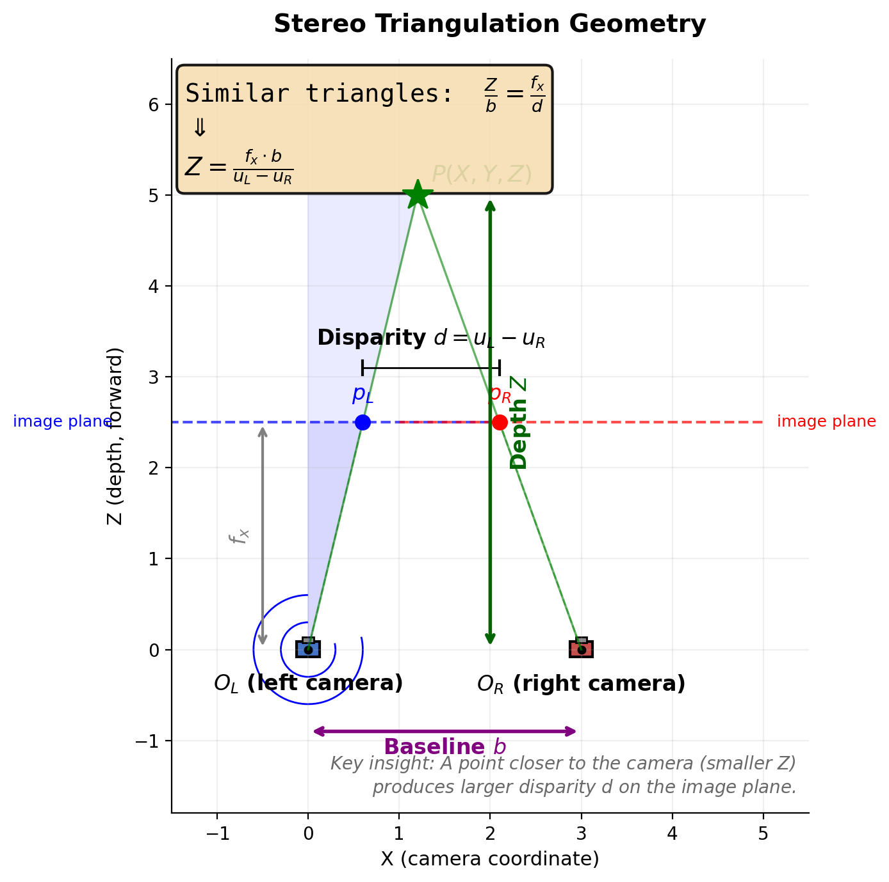

# VINS-Fusion 纯双目 VO 数学模型

## 1. 引言

纯双目视觉里程计（Stereo Visual Odometry, VO）是 VINS-Fusion 在 `imu: 0` 模式下的运行方式。与 VIO（视觉惯性里程计）相比，纯 VO 完全依赖双目相机的视觉观测进行位姿估计，不使用 IMU 数据。

**纯双目 VO 的核心特点：**

| 特性 | VIO (`imu: 1`) | 纯 VO (`imu: 0`) |
|------|---------------|-----------------|
| 传感器 | 相机 + IMU | 仅双目相机 |
| 状态向量 | 位姿 + 速度 + IMU 零偏 | **仅位姿** |
| 运动约束 | IMU 预积分 + 视觉重投影 | **仅视觉重投影** |
| 尺度 | IMU 加速度计提供绝对尺度 | **双目基线提供绝对尺度** |
| 初始化 | 视觉 SFM + 惯性对齐 | **纯视觉 SFM** |
| 目标函数 | IMU 残差 + 视觉残差 + 先验 | **视觉残差 + 先验** |
| 输出频率 | 与图像帧率相同（如 30 Hz） | 与图像帧率相同 |

> 📁 **源码位置**：`vins/src/rosNodeTest.cpp:main()`
>
> 程序执行顺序：`readParameters()` 读取 `imu: 0` → `ESTIMATE_EXTRINSIC = 0`（固定外参）→ `estimator.setParameter()` → `executor.spin()`

---

## 2. 坐标系与符号约定

- $\mathcal{W}$：世界坐标系（World Frame），**纯 VO 模式下与初始化时刻的左目相机坐标系重合**
- $\mathcal{C}_0$：左目相机坐标系（Camera 0）
- $\mathcal{C}_1$：右目相机坐标系（Camera 1）
- $\mathbf{p}_k^W \in \mathbb{R}^3$：第 $k$ 帧左目相机在世界系下的位置
- $\mathbf{q}_k^W \in SO(3)$：第 $k$ 帧左目相机在世界系下的姿态（四元数）
- $\mathbf{P}^W \in \mathbb{R}^3$：三维路标点在世界系下的坐标

### 2.1 纯 VO 模式下 World 坐标系的定义

纯 VO 与 VIO 在 World 坐标系定义上有本质区别：

| 特性 | 纯 VO (`imu: 0`) | VIO (`imu: 1`) |
|------|-----------------|---------------|
| **World 原点** | 第一帧 Camera0 位置 | 第一帧 Camera0 位置 |
| **World 朝向** | **与第一帧 Camera0 朝向重合** | Z 轴对齐重力反方向 |
| **定义方式** | `clearState()` 硬编码 `Rs[0]=I` | `initialStructure()` 重力对齐 |
| **代码路径** | `estimator.cpp:557-571` | `estimator.cpp:631-836` |

**纯 VO 的 World 系就是第一帧的视觉系**：

```cpp
// clearState() 中硬编码
Rs[0].setIdentity();   // R_world_body0 = I
Ps[0].setZero();       // t_world_body0 = 0
```

第一帧的 body/camera0 坐标系被直接定义为 World 坐标系，因此：

$$
\mathbf{T}_{\mathcal{W}}^{\mathcal{C}_0} = \begin{bmatrix} \mathbf{I} & \mathbf{0} \\ \mathbf{0}^T & 1 \end{bmatrix}
$$

> ⚠️ **注意**：之前分析的矩阵 $\begin{bmatrix} 0 & 0 & 1 \\ -1 & 0 & 0 \\ 0 & -1 & 0 \end{bmatrix}$ 是 **VIO 重力对齐后**的结果（`Utility::g2R(g)`），不是纯 VO 的情况。纯 VO 没有 IMU 测量，无法进行重力对齐，因此 World 系的朝向完全由启动时的相机姿态决定。

**双目外参（固定不变）：**

在纯 VO 模式下，左目为参考相机（body），其外参为单位矩阵：

$$
\mathbf{T}_{C_0}^B = \begin{bmatrix} \mathbf{I} & \mathbf{0} \\ \mathbf{0}^T & 1 \end{bmatrix}
$$

右目相对左目的变换由双目基线 $b$ 决定（通常为 ~50 mm）：

$$
\mathbf{T}_{C_1}^{C_0} = \begin{bmatrix} \mathbf{I} & [b, 0, 0]^T \\ \mathbf{0}^T & 1 \end{bmatrix}
$$

即右目仅相对左目在 $X$ 方向平移基线距离 $b$。

---

## 3. 视觉前端——特征跟踪与双目匹配

> 📁 **源码位置**：`vins/src/featureTracker/feature_tracker.cpp:trackImage()` / `feature_tracker.h`
>
> **输入**：当前帧左目灰度图 `cur_img`、右目灰度图 `rightImg`（可选）
>
> **输出**：`featureFrame`，类型为 `map<int, vector<pair<int, Eigen::Matrix<double, 7, 1>>>>`
>
> **核心任务**：
> 1. 将上一帧跟踪到的特征点通过 **LK 光流** 传递到当前帧左目；
> 2. 用 **双向一致性检验** 剔除光流失败的外点；
> 3. 通过 **Shi-Tomasi 角点检测** 补充新特征点，保持总数恒定；
> 4. 用 **setMask()** 实现特征点空间均匀分布；
> 5. 通过 **LK 光流** 在当前帧右目寻找对应点，完成双目匹配；
> 6. 打包为 `FeatureFrame` 供后端优化器使用。

---

### 3.1 前端整体架构与数据流

`trackImage()` 的完整执行流程如下：

```
┌─────────────────────────────────────────────────────────────────┐
│  trackImage(cur_time, cur_img, rightImg)                        │
├─────────────────────────────────────────────────────────────────┤
│  Step 1: 时序光流 (prev_left → cur_left)                        │
│          └─ cv::calcOpticalFlowPyrLK() 正向 + 反向一致性检验    │
│  Step 2: 边界过滤 & 状态筛选                                     │
│          └─ inBorder() + reduceVector()                         │
│  Step 3: 跟踪计数递增 (track_cnt++)                             │
│  Step 4: F 矩阵 RANSAC 外点剔除 (当前被注释)                    │
│          └─ rejectWithF()                                       │
│  Step 5: setMask() — 特征点空间均匀分布                         │
│          └─ 按 track_cnt 排序 + MIN_DIST 半径遮罩               │
│  Step 6: 新角点检测 (Shi-Tomasi)                                │
│          └─ cv::goodFeaturesToTrack()                           │
│  Step 7: 添加新点 (addPoints)                                   │
│  Step 8: 左目去畸变 & 速度计算                                  │
│          └─ undistortedPts() + ptsVelocity()                    │
│  Step 9: 双目匹配 (cur_left → cur_right)                        │
│          └─ cv::calcOpticalFlowPyrLK() 正向 + 反向一致性检验    │
│  Step 10: 可视化 (drawTrack)                                    │
│  Step 11: 更新状态，供下一帧使用                                │
│  Step 12: 构建 featureFrame 输出                                │
└─────────────────────────────────────────────────────────────────┘
```

---

### 3.2 角点检测：Shi-Tomasi 算法

#### 3.2.1 图像局部结构张量

在图像 $I(x, y)$ 中，考虑一个局部窗口 $W$。当窗口发生微小位移 $(\Delta x, \Delta y)$ 时，窗口内灰度变化量为：

$$
E(\Delta x, \Delta y) = \sum_{(x,y) \in W} w(x, y) \left[ I(x + \Delta x, y + \Delta y) - I(x, y) \right]^2
$$

其中 $w(x, y)$ 为窗口权重（通常为高斯权重或均匀权重）。对 $I(x + \Delta x, y + \Delta y)$ 做一阶泰勒展开：

$$
I(x + \Delta x, y + \Delta y) \approx I(x, y) + I_x \Delta x + I_y \Delta y
$$

其中 $I_x = \frac{\partial I}{\partial x}$，$I_y = \frac{\partial I}{\partial y}$ 为图像梯度。代入得：

$$
E(\Delta x, \Delta y) \approx \sum_{(x,y) \in W} w(x, y) \begin{bmatrix} \Delta x & \Delta y \end{bmatrix} \begin{bmatrix} I_x^2 & I_x I_y \\ I_x I_y & I_y^2 \end{bmatrix} \begin{bmatrix} \Delta x \\ \Delta y \end{bmatrix}
$$

定义 **结构张量（Structure Tensor）**：

$$
\mathbf{M} = \sum_{(x,y) \in W} w(x, y) \begin{bmatrix} I_x^2 & I_x I_y \\ I_x I_y & I_y^2 \end{bmatrix} = \begin{bmatrix} A & C \\ C & B \end{bmatrix}
$$

则灰度变化量可写为二次型：

$$
E(\Delta x, \Delta y) \approx \begin{bmatrix} \Delta x & \Delta y \end{bmatrix} \mathbf{M} \begin{bmatrix} \Delta x \\ \Delta y \end{bmatrix}
$$

#### 3.2.2 Harris 角点响应与 Shi-Tomasi 改进

**Harris 角点检测器** 定义响应函数：

$$
R = \det(\mathbf{M}) - k \cdot \text{tr}^2(\mathbf{M}) = (AB - C^2) - k(A + B)^2
$$

其中 $k \approx 0.04 \sim 0.06$ 为经验常数。$R$ 较大时表示该点为角点。

**Shi-Tomasi 改进**（OpenCV `goodFeaturesToTrack` 默认算法）：

直接考察结构张量 $\mathbf{M}$ 的两个特征值 $\lambda_1, \lambda_2$（假设 $\lambda_1 \geq \lambda_2$）：

- 若 $\lambda_1 \approx 0, \lambda_2 \approx 0$：平坦区域，灰度变化小
- 若 $\lambda_1 \gg 0, \lambda_2 \approx 0$：边缘，仅沿一个方向变化大
- 若 $\lambda_1 \gg 0, \lambda_2 \gg 0$：**角点**，两个方向变化都大

Shi-Tomasi 的角点响应定义为：

$$
R_{ST} = \min(\lambda_1, \lambda_2)
$$

当 $R_{ST}$ 大于给定阈值时，该点被判定为角点。与 Harris 相比，Shi-Tomasi 不需要调参 $k$，对角点的判定更稳定。

#### 3.2.3 OpenCV 实现与参数

```cpp
// feature_tracker.cpp (CPU path)
cv::goodFeaturesToTrack(cur_img, n_pts, MAX_CNT - cur_pts.size(),
                        qualityLevel = 0.01, MIN_DIST, mask);
```

| 参数 | 典型值 | 含义 |
|------|--------|------|
| `maxCorners` | `MAX_CNT - cur_pts.size()` | 最多检测的新角点数 |
| `qualityLevel` | `0.01` | 最小可接受角点响应为最大响应的 1% |
| `minDistance` | `MIN_DIST`（如 30 px） | 角点之间的最小欧氏距离 |
| `mask` | `setMask()` 生成的遮罩 | 已有特征点周围禁止检测新角点 |

> **关键点**：`mask` 由 `setMask()` 动态生成（见 3.5 节），确保新检测的角点不会落在已有特征点的 `MIN_DIST` 邻域内，从而实现特征点的空间均匀分布。

---

### 3.3 LK 光流跟踪

#### 3.3.1 亮度恒定假设

**Lucas-Kanade (LK)** 光流法的核心假设：**同一空间点在相邻帧图像上的灰度值保持不变**。

设 $t$ 时刻图像为 $I(x, y, t)$，$t + \Delta t$ 时刻该点移动到 $(x + \Delta x, y + \Delta y)$，则：

$$
I(x, y, t) = I(x + \Delta x, y + \Delta y, t + \Delta t)
$$

#### 3.3.2 光流约束方程

对右端做一阶泰勒展开：

$$
I(x + \Delta x, y + \Delta y, t + \Delta t) \approx I(x, y, t) + I_x \Delta x + I_y \Delta y + I_t \Delta t
$$

代入亮度恒定假设，忽略高阶项：

$$
I_x \Delta x + I_y \Delta y + I_t \Delta t = 0
$$

两边除以 $\Delta t$，记 $u = \frac{\Delta x}{\Delta t}$，$v = \frac{\Delta y}{\Delta t}$ 为像素速度（光流）：

$$
I_x u + I_y v = -I_t
$$

这是 **光流约束方程**，一个方程两个未知数，属于**欠定问题**。

**局部光流假设**：在一个小窗口 $W$ 内，所有像素共享相同的光流 $(u, v)$。对窗口内 $n$ 个像素列出方程组：

$$
\begin{bmatrix}
I_x(x_1, y_1) & I_y(x_1, y_1) \\
I_x(x_2, y_2) & I_y(x_2, y_2) \\
\vdots & \vdots \\
I_x(x_n, y_n) & I_y(x_n, y_n)
\end{bmatrix}
\begin{bmatrix} u \\ v \end{bmatrix}
=
-\begin{bmatrix} I_t(x_1, y_1) \\ I_t(x_2, y_2) \\ \vdots \\ I_t(x_n, y_n) \end{bmatrix}
$$

即 $\mathbf{A} \mathbf{d} = \mathbf{b}$，用最小二乘法求解：

$$
\mathbf{d} = (\mathbf{A}^T \mathbf{A})^{-1} \mathbf{A}^T \mathbf{b}
$$

其中：

$$
\mathbf{A}^T \mathbf{A} = \sum_{(x,y) \in W} \begin{bmatrix} I_x^2 & I_x I_y \\ I_x I_y & I_y^2 \end{bmatrix} = \mathbf{M}
$$

这正是 3.2.1 节中的 **结构张量**。LK 光流要求 $\mathbf{M}$ 可逆，即窗口内必须包含足够的纹理（两个特征值都较大）——这也是 LK 光流与角点检测天然配套的原因。

#### 3.3.3 金字塔 LK 光流

当相机运动较快时，帧间位移可能超过 LK 光流的小位移假设（通常 > 3~5 像素时假设失效）。**金字塔 LK** 通过图像多分辨率分解解决这一问题。

**原理**：
1. 构建图像高斯金字塔 $I^{(0)}, I^{(1)}, \dots, I^{(L)}$，其中 $I^{(0)}$ 为原图，$I^{(L)}$ 为最粗分辨率
2. 从最粗层开始计算光流，得到初始估计 $\mathbf{d}^{(L)}$
3. 将 $\mathbf{d}^{(L)}$ 传递到下一层作为初始值，逐层细化
4. 最终层得到亚像素精度的光流估计

**VINS 中的参数**：

```cpp
// 时序跟踪（prev → cur）
cv::calcOpticalFlowPyrLK(prev_img, cur_img, prev_pts, cur_pts, status, err,
                         cv::Size(21, 21), 3,
                         cv::TermCriteria(cv::TermCriteria::COUNT + cv::TermCriteria::EPS, 30, 0.01),
                         cv::OPTFLOW_USE_INITIAL_FLOW);
```

| 参数 | 值 | 含义 |
|------|-----|------|
| `winSize` | `21 × 21` | 光流计算窗口大小 |
| `maxLevel` | `3` | 金字塔层数（0=原图, 1=1/2, 2=1/4, 3=1/8） |
| `criteria` | `30 iter / 0.01 eps` | 迭代终止条件 |
| `flags` | `OPTFLOW_USE_INITIAL_FLOW` | 使用 `predict_pts` 作为初始值（warm-start） |

> **Warm-start 优化**：如果后端估计器提供了 3D 点投影预测（`hasPrediction == true`），则使用预测位置作为光流初始值，并将金字塔层数降为 1，大幅加速收敛。如果预测失败（< 10 个点成功），自动回退到 3 层金字塔冷启动。

#### 3.3.4 双向一致性检验（Forward-Backward Check）

LK 光流可能因遮挡、光照变化、运动模糊等原因产生错误匹配。**双向一致性检验**通过反向跟踪验证匹配的正确性。

**流程**：
1. **正向跟踪**：$I_{t} \rightarrow I_{t+1}$，得到 $\mathbf{p}_{t+1}$
2. **反向跟踪**：$I_{t+1} \rightarrow I_{t}$，从 $\mathbf{p}_{t+1}$ 出发，得到 $\hat{\mathbf{p}}_{t}$
3. **一致性判断**：若正向和反向均收敛，且往返误差小于阈值，则接受：

$$
\|\mathbf{p}_{t} - \hat{\mathbf{p}}_{t}\| \leq 0.5 \text{ px}
$$

**代码实现**：

```cpp
// 正向
cv::calcOpticalFlowPyrLK(prev_img, cur_img, prev_pts, cur_pts, status, err, ...);
// 反向
cv::calcOpticalFlowPyrLK(cur_img, prev_img, cur_pts, reverse_pts, reverse_status, err, ...);

// 一致性门控
for (i) {
    if (status[i] && reverse_status[i]
        && distance(prev_pts[i], reverse_pts[i]) <= 0.5)
        status[i] = 1;
    else
        status[i] = 0;
}
```

双向检验能有效剔除因遮挡导致的光流漂移和陷入局部极小值的错误匹配。

---

### 3.4 外点剔除：基础矩阵与 RANSAC

> ⚠️ **代码现状**：`rejectWithF()` 在当前 `trackImage()` 中**被注释掉了**，因此 F 矩阵外点剔除**未实际生效**。但其数学原理仍是视觉前端的重要环节。

#### 3.4.1 对极几何与基础矩阵

对于两个视角下的图像点 $\mathbf{p} = [u, v, 1]^T$（当前帧）和 $\mathbf{p}' = [u', v', 1]^T$（上一帧），若它们对应同一三维点，则满足 **对极约束**：

$$
\mathbf{p}'^T \mathbf{F} \mathbf{p} = 0
$$

其中 $\mathbf{F}$ 为 **基础矩阵（Fundamental Matrix）**，是一个 $3 \times 3$ 的秩-2 矩阵，包含了对极几何的全部信息。

基础矩阵与本质矩阵 $\mathbf{E}$ 的关系：

$$
\mathbf{F} = \mathbf{K}^{-T} \mathbf{E} \mathbf{K}^{-1} = \mathbf{K}^{-T} [\mathbf{t}]_\times \mathbf{R} \mathbf{K}^{-1}
$$

其中 $(\mathbf{R}, \mathbf{t})$ 为两帧间的相对位姿，$\mathbf{K}$ 为相机内参矩阵。

#### 3.4.2 八点法估计 F

基础矩阵有 7 个自由度（9 个元素，尺度不定，秩-2 约束）。理论上需要 7 对匹配点即可求解（7-point algorithm），但 OpenCV 采用数值更稳定的 **8-point algorithm**：

对 $N \geq 8$ 对匹配点，每对提供一个线性约束：

$$
u' u f_{11} + \nu' v f_{12} + \nu' f_{13} + u' u f_{21} + u' v f_{22} + u' f_{23} + u f_{31} + v f_{32} + f_{33} = 0$$

（注：原文为 $v' u f_{11} + v' v f_{12} + ...$，此处规范写法）

堆叠为 $\mathbf{A} \mathbf{f} = \mathbf{0}$，对 $\mathbf{A}$ 做 SVD，最小奇异值对应的右奇异向量即为 $\mathbf{f}$（展平后的 $\mathbf{F}$）。

**坐标归一化**：为提高数值稳定性，VINS 在估计 F 前先对像素坐标做归一化：

```cpp
// 将像素提升为单位射线，再投影到归一化焦距平面
m_camera[0]->liftProjective(Eigen::Vector2d(cur_pts[i].x, cur_pts[i].y), tmp_p);
tmp_p.x() = FOCAL_LENGTH * tmp_p.x() / tmp_p.z() + col / 2.0;
tmp_p.y() = FOCAL_LENGTH * tmp_p.y() / tmp_p.z() + row / 2.0;
```

其中 `FOCAL_LENGTH = 460.0`，`liftProjective()` 将畸变像素反投影到归一化平面（去畸变）。

#### 3.4.3 RANSAC 鲁棒估计

实际匹配中存在外点（误匹配），直接用最小二乘会被外点污染。VINS 使用 **RANSAC（Random Sample Consensus）** 鲁棒估计：

```cpp
cv::findFundamentalMat(un_cur_pts, un_prev_pts, cv::FM_RANSAC,
                       F_THRESHOLD, 0.99, status);
```

| 参数 | 含义 |
|------|------|
| `F_THRESHOLD` | 点到极线的距离阈值（像素），配置文件读取 |
| `0.99` | RANSAC 置信度 |
| `status` | 输出掩码，`1`=内点，`0`=外点 |

**RANSAC 流程**：
1. 随机采样 8 对匹配点
2. 用 8-point algorithm 估计 $\mathbf{F}$
3. 计算所有匹配点到对应极线的距离，统计内点数
4. 重复 1~3，保留内点数最多的模型
5. 用所有内点重新精修 $\mathbf{F}$

#### 3.4.4 为什么当前被注释

在 VINS-Fusion 的 feature_tracker.cpp 中，`rejectWithF()` 的调用被注释掉了：

```cpp
// rejectWithF();
```

可能的原因：
- 双向 LK 一致性检验已经剔除了大部分光流外点，F 矩阵剔除的边际收益降低
- RANSAC 增加了计算开销，在实时系统中被简化
- 双目模式下，右目匹配提供了额外的几何约束

---

### 3.5 特征点均匀分布策略：setMask()

特征点在图像上的空间分布直接影响 VO 的精度和鲁棒性。如果所有特征点聚集在图像的一角，其他区域缺乏约束，位姿估计将在某些自由度上不稳定。

**VINS 的解决方案**：`setMask()` 实现了一种**无网格的非极大值抑制（NMS）**。

```cpp
void FeatureTracker::setMask() {
    mask = cv::Mat(row, col, CV_8UC1, cv::Scalar(255));

    // 按 track_cnt（跟踪长度）降序排序
    vector<pair<int, pair<cv::Point2f, int>>> cnt_pts_id;
    for (unsigned int i = 0; i < cur_pts.size(); i++)
        cnt_pts_id.push_back(make_pair(track_cnt[i], make_pair(cur_pts[i], ids[i])));
    sort(cnt_pts_id.begin(), cnt_pts_id.end(),
         [](const auto &a, const auto &b) { return a.first > b.first; });

    cur_pts.clear(); ids.clear(); track_cnt.clear();

    // 贪心空间选择
    for (auto &it : cnt_pts_id) {
        if (mask.at<uchar>(it.second.first) == 255) {
            cur_pts.push_back(it.second.first);
            ids.push_back(it.second.second);
            track_cnt.push_back(it.first);
            cv::circle(mask, it.second.first, MIN_DIST, 0, -1);  // 画黑圆遮罩
        }
    }
}
```

**算法逻辑**：
1. **初始化遮罩**：全白图像（`255`），表示所有位置都允许保留特征点
2. **优先级排序**：按 `track_cnt`（连续跟踪帧数）**降序**排列。跟踪时间越长的特征点优先级越高——它们更稳定、三角化深度更可靠
3. **贪心选择**：遍历排序后的特征点。若该点位于白色区域，则保留它，并在其周围半径 `MIN_DIST` 内画黑色圆盘。后续特征点若落在此圆盘内则被丢弃

**效果示意**：

```
原始特征点分布          setMask() 后              新检测遮罩
┌─────────────┐        ┌─────────────┐          ┌─────────────┐
│  ●  ●●      │   →    │  ●  ○       │    +     │  ░  ░░      │
│    ●        │        │    ○        │          │    ░        │
│  ●●●   ●    │        │  ●●   ○     │          │  ░░░   ░    │
└─────────────┘        └─────────────┘          └─────────────┘
●=保留  ○=被遮罩丢弃    ░=允许检测新角点的区域
```

这种策略确保：
- 长时间跟踪的稳定特征点优先保留
- 特征点在空间上均匀分布，避免扎堆
- 新检测的角点自动填补空白区域

---

### 3.6 双目匹配

#### 3.6.1 极线约束与 LK 光流匹配

双目匹配的目标：对于左目中的每个特征点 $\mathbf{p}_L = [u_L, v_L]^T$，在右目图像中找到对应点 $\mathbf{p}_R = [u_R, v_R]^T$。

**传统方法**：块匹配（Block Matching）、SGM 半全局匹配等，沿极线搜索。

**VINS 的方法**：将双目匹配视为 **光流问题**——假设左右目同时拍摄，空间点在两幅图像上的投影之间的位移仅由基线平移引起，用 LK 光流直接求解。

```cpp
cv::calcOpticalFlowPyrLK(cur_img, rightImg, cur_pts, cur_right_pts, status, err,
                         cv::Size(21, 21), 3);
```

**与极线约束的关系**：

对于平行放置的双目相机（仅 $X$ 方向平移基线 $b$），理想情况下匹配点严格满足水平极线约束：

$$
v_L = v_R
$$

即匹配点在同一水平线上，水平视差为：

$$
d = u_L - u_R
$$

LK 光流 implicitly 利用了极线约束——因为光流在 $Y$ 方向的位移很小（理想情况下为 0），小窗口搜索自然不会偏离极线太远。相比块匹配，LK 光流对光照变化更鲁棒，且天然支持亚像素精度。

#### 3.6.2 匹配有效性检验

双目匹配同样执行 **双向一致性检验**：

```cpp
// 正向：左目 → 右目
cv::calcOpticalFlowPyrLK(cur_img, rightImg, cur_pts, cur_right_pts, status, err, cv::Size(21, 21), 3);
// 反向：右目 → 左目
cv::calcOpticalFlowPyrLK(rightImg, cur_img, cur_right_pts, reverseLeftPts, statusRightLeft, err, cv::Size(21, 21), 3);

// 一致性门控
for (i) {
    if (status[i] && statusRightLeft[i]
        && inBorder(cur_right_pts[i])
        && distance(cur_pts[i], reverseLeftPts[i]) <= 0.5)
        status[i] = 1;
    else
        status[i] = 0;
}
```

检验条件：
1. 正向光流收敛
2. 反向光流收敛
3. 右目匹配点在图像边界内（`inBorder`，留 1 像素边距）
4. 往返误差 $\leq 0.5$ 像素

#### 3.6.3 左目特征保留策略

**重要设计**：双目匹配失败时，**左目特征点仍然保留**。

```cpp
ids_right = ids;
reduceVector(cur_right_pts, status);
reduceVector(ids_right, status);
// 注意：cur_pts（左目）不被 reduce！
```

这意味着：
- 只要左目跟踪成功，特征点就进入后端优化
- 右目匹配失败仅意味着该特征点在当前帧只有单目观测
- 后端优化中，单目观测和双目观测分别用不同的残差因子（`ProjectionTwoFrameOneCamFactor` vs `ProjectionTwoFrameTwoCamFactor`）

这种设计提高了系统的鲁棒性——即使右目因遮挡、反光等原因匹配失败，左目的时序跟踪仍然维持。

---

### 3.7 输出数据结构：FeatureFrame

`trackImage()` 的最终输出是一个嵌套的关联容器：

```cpp
map<int, vector<pair<int, Eigen::Matrix<double, 7, 1>>>> featureFrame;
```

**语义解析**：

| 层级 | 类型 | 含义 |
|------|------|------|
| **外层 Key** | `int` | 全局特征点 ID `feature_id`（跨帧持久） |
| **Value** | `vector<pair<int, Matrix<double,7,1>>>` | 该特征点在所有相机上的观测 |
| **pair.first** | `int camera_id` | `0`=左目, `1`=右目 |
| **pair.second** | `Matrix<double,7,1>` | 7 维观测向量 `xyz_uv_velocity` |

**7 维观测向量 `[x, y, z, p_u, p_v, v_x, v_y]^T`：**

| 分量 | 来源 | 数学含义 |
|------|------|---------|
| $x, y, z$ | `undistortedPts()` | 去畸变后的**归一化平面坐标**，$z$ 硬编码为 `1.0`。即 $\mathbf{m} = [x/z, y/z, 1]^T = [x, y, 1]^T$ |
| $p_u, p_v$ | `cur_pts` | 原始畸变**像素坐标** $(u, v)$ |
| $v_x, v_y$ | `ptsVelocity()` | 归一化平面上的**时序速度**：$(\mathbf{m}_{cur} - \mathbf{m}_{prev}) / \Delta t$ |

**速度计算**：

```cpp
// ptsVelocity() 伪代码
for each feature_id:
    if (feature_id exists in prev_un_pts_map):
        v = (cur_un_pts[feature_id] - prev_un_pts[feature_id]) / (cur_time - prev_time);
    else:
        v = (0, 0);  // 新检测点，无历史观测
```

速度信息在 VINS 中用于**外参标定**和**时间偏移估计**（`ESTIMATE_TD`），在纯 VO 固定外参模式下不直接使用，但仍随数据传递。

**构建顺序**：
1. 遍历所有左目特征点 `ids`，插入 `camera_id = 0`
2. 遍历所有右目特征点 `ids_right`，插入 `camera_id = 1`（共享相同的 `feature_id`）

后端优化器根据 `feature_id` 将左右目观测关联到同一个三维路标点。

---

### 3.8 关键参数与性能分析

| 参数 | 源码变量 | 典型值 | 作用 | 调大/调小的影响 |
|------|---------|--------|------|----------------|
| **最大特征点数** | `MAX_CNT` | 150 | 每帧跟踪的最大特征点总数 | ↑ 更鲁棒但更慢；↓ 更快但易丢跟踪 |
| **最小特征间距** | `MIN_DIST` | 30 px | `setMask()` 的遮罩半径 | ↑ 分布更稀疏；↓ 分布更密集 |
| **RANSAC 阈值** | `F_THRESHOLD` | 1.0 px | `rejectWithF()` 的内点距离阈值 | ↑ 更宽容但外点多；↓ 更严格但可能剔内点 |
| **光流窗口** | `winSize` | 21×21 | LK 光流计算窗口 | ↑ 适合大位移但慢；↓ 快但易丢 |
| **金字塔层数** | `maxLevel` | 3 | 时序光流金字塔 | ↑ 适合快速运动；↓ 更精细但范围小 |
| **角点质量阈值** | `qualityLevel` | 0.01 | Shi-Tomasi 最小响应比例 | ↑ 角点更强但数量少；↓ 数量多但弱 |

**性能瓶颈分析**：

在纯 VO 模式下，前端是计算最密集的模块。主要开销分布：

1. **LK 光流（时序跟踪）**：~40% — 正向 + 反向两次光流
2. **LK 光流（双目匹配）**：~30% — 正向 + 反向两次光流
3. **角点检测**：~15% — `goodFeaturesToTrack`
4. **去畸变 & 速度计算**：~10%
5. **其他**：~5%

> **D435i @ 848×480, 30 Hz 实测**：前端处理一帧约 15~25 ms，占满 33 ms 帧间隔的大部分。如果特征点数增加到 200+ 或图像分辨率提高到 1280×720，前端可能成为瓶颈导致丢帧。

---

### 3.9 前端与后端的接口边界

前端（`FeatureTracker`）与后端（`Estimator`）的职责划分：

| 职责 | 前端 | 后端 |
|------|------|------|
| 图像灰度处理 | ✓ | ✗ |
| 特征点检测/跟踪 | ✓ | ✗ |
| 双目匹配 | ✓ | ✗ |
| 去畸变（像素→归一化平面） | ✓ | ✗ |
| **三角化恢复 3D 路标点** | ✗ | ✓ |
| **位姿估计（PnP / BA）** | ✗ | ✓ |
| **滑动窗口优化** | ✗ | ✓ |
| 边缘化 | ✗ | ✓ |

前端输出的是**二维观测**（像素位置、归一化坐标、速度），不包含任何三维信息。三维路标点的三角化和位姿优化完全由后端负责。这种解耦设计使得前端可以独立运行和调试，后端也可以灵活替换不同的视觉里程计算法。
## 4. 双目视觉测量模型

### 4.1 针孔相机模型

对于三维点 $\mathbf{P}^C = [X, Y, Z]^T$ 在相机坐标系下的坐标，投影到归一化平面：

$$
\mathbf{p}_n = \begin{bmatrix} x \\ y \end{bmatrix} = \begin{bmatrix} X/Z \\ Y/Z \end{bmatrix}
$$

像素坐标：

$$
\mathbf{p}_{pix} = \begin{bmatrix} f_x x + c_x \\ f_y y + c_y \end{bmatrix} = \mathbf{K} \, \mathbf{p}_n
$$

### 4.2 双目三角化

双目三角化是利用左右目观测恢复三维路标点位置的核心步骤。

**几何原理：**

设左目和右目的投影矩阵分别为 $\mathbf{P}_L$ 和 $\mathbf{P}_R$（$3 \times 4$ 矩阵）。对于空间点 $\mathbf{P}^W = [X, Y, Z, 1]^T$，在左右目图像上的投影为：

$$
s_L \begin{bmatrix} u_L \\ v_L \\ 1 \end{bmatrix} = \mathbf{P}_L \mathbf{P}^W, \quad s_R \begin{bmatrix} u_R \\ v_R \\ 1 \end{bmatrix} = \mathbf{P}_R \mathbf{P}^W
$$

其中 $s_L, s_R$ 为深度因子。

**线性三角化（Direct Linear Transform, DLT）：**

将两个投影方程堆叠，消去 $s_L, s_R$，得到关于 $\mathbf{P}^W$ 的线性方程组：

$$
\begin{bmatrix}
u_L \mathbf{P}_{L,3}^T - \mathbf{P}_{L,1}^T \\
v_L \mathbf{P}_{L,3}^T - \mathbf{P}_{L,2}^T \\
u_R \mathbf{P}_{R,3}^T - \mathbf{P}_{R,1}^T \\
v_R \mathbf{P}_{R,3}^T - \mathbf{P}_{R,2}^T
\end{bmatrix} \mathbf{P}^W = \mathbf{0}
$$

其中 $\mathbf{P}_{L,i}^T$ 为 $\mathbf{P}_L$ 的第 $i$ 行。这是一个 $4 \times 4$ 的齐次线性方程组，用 SVD 求解最小二乘解，得到 $\mathbf{P}^W$。

**简化形式（平行双目）：**

如果左右目完全平行（仅 $X$ 方向平移基线 $b$），且内参相同：

$$
Z = \frac{f_x \cdot b}{u_L - u_R} = \frac{f_x \cdot b}{d}
$$

$$X = Z \cdot \frac{u_L - c_x}{f_x}, \quad Y = Z \cdot \frac{v_L - c_y}{f_y}$$

其中 $d = u_L - u_R$ 为视差。**视差越大，深度越近；视差越小，深度越远。**

> 📁 **源码位置**：`vins/src/estimator/feature_manager.cpp:triangulatePoint()`
>
> VINS 中的三角化使用 OpenCV 的 `cv::triangulatePoints()`，基于 DLT 方法。

### 4.3 逆深度参数化

为了减少参数数量并提高数值稳定性，VINS 采用 **逆深度（Inverse Depth）** 参数化。将特征点在第 $i$ 次观测帧中的深度 $d$ 表示为 $\lambda = 1/d$：

$$
\mathbf{P}^W = \mathbf{R}_i^W \left( \frac{1}{\lambda} \mathbf{m}_i \right) + \mathbf{p}_i^W
$$

其中 $\mathbf{m}_i$ 为由像素坐标反投影得到的单位方向向量：

$$
\mathbf{m}_i = \frac{1}{\sqrt{x^2 + y^2 + 1}} \begin{bmatrix} x \\ y \\ 1 \end{bmatrix}
$$

**优势**：
- 特征点位于无穷远处时，$\lambda \to 0$，数值稳定
- 比直接参数化 $[X, Y, Z]$ 少一个自由度（因为方向已知）

---

## 5. 重投影误差

### 5.1 单目重投影误差

对于滑动窗口中一个被多帧观测到的路标点 $\mathbf{P}^W$，其在第 $k$ 帧左目图像中的重投影误差为：

$$
\mathbf{r}_{C_{kj}} = \mathbf{p}_{kj}^{obs} - \pi_c \left( \mathbf{P}^C \right)
$$

其中三维点在第 $k$ 帧左目相机坐标系下的坐标：

$$
\mathbf{P}^{C_0} = \mathbf{R}_W^k \left( \mathbf{P}^W - \mathbf{p}_k^W \right)
$$

投影函数 $\pi_c(\cdot)$ 包含去畸变和内参变换。

### 5.2 双目重投影误差

在双目模式下，路标点 $\mathbf{P}^W$ 同时在左目和右目产生重投影误差：

**左目残差：**

$$
\mathbf{r}_{L} = \mathbf{p}_{L}^{obs} - \pi_c \left( \mathbf{R}_W^k (\mathbf{P}^W - \mathbf{p}_k^W) \right)
$$

**右目残差：**

$$
\mathbf{r}_{R} = \mathbf{p}_{R}^{obs} - \pi_c \left( \mathbf{R}_{C_0}^{C_1} \mathbf{R}_W^k (\mathbf{P}^W - \mathbf{p}_k^W) + \mathbf{t}_{C_0}^{C_1} \right)
$$

其中 $(\mathbf{R}_{C_0}^{C_1}, \mathbf{t}_{C_0}^{C_1})$ 为右目相对左目的外参（通常 $\mathbf{R} = \mathbf{I}$，$\mathbf{t} = [b, 0, 0]^T$）。

> 📁 **源码位置**：`vins/src/estimator/feature_manager.cpp:triangulate()` / `vins/src/factor/projection_two_frame_two_cam_factor.cpp`
>
> 双目重投影残差在优化时同时约束左目和右目观测。

---

## 6. 滑动窗口状态估计与优化

### 6.1 状态向量（纯 VO 简化版）

纯 VO 模式下，状态向量仅包含位姿和逆深度，**没有速度、零偏**：

$$
\mathbf{x}_k^{VO} = \left[ \mathbf{p}_k^W, \mathbf{q}_k^W \right]
$$

整个滑动窗口的状态向量：

$$
\mathcal{X}^{VO} = \left[ \mathbf{x}_0^{VO}, \mathbf{x}_1^{VO}, \dots, \mathbf{x}_n^{VO}, \lambda_0, \lambda_1, \dots, \lambda_m \right]
$$

其中 $n+1 = 11$（`WINDOW_SIZE = 10`），$\lambda_j$ 为第 $j$ 个路标点的逆深度。

### 6.2 目标函数

纯 VO 的目标函数**仅包含视觉残差和先验**（无 IMU 残差）：

$$
\min_{\mathcal{X}^{VO}} \left\{ \sum_{(k,j) \in \mathcal{C}} \rho \left( \|\mathbf{r}_{C_{kj}}(\hat{\mathbf{z}}_{k}^{j}, \mathcal{X}^{VO})\|_{\boldsymbol{\Sigma}_{C_{kj}}}^2 \right) + \|\mathbf{r}_p\|_{\boldsymbol{\Sigma}_p}^2 \right\}
$$

其中：
- 第一项为 **视觉残差**，包括左目和右目的重投影误差；
- 第二项为 **先验残差**（来自边缘化）；
- $\rho(\cdot)$ 为 Huber 鲁棒核函数，降低外点影响；
- $\mathcal{C}$ 为所有视觉观测约束的集合。

**与 VIO 目标函数的对比：**

| 项 | VIO (`imu: 1`) | 纯 VO (`imu: 0`) |
|---|---------------|-----------------|
| IMU 残差 | $\sum \|\mathbf{r}_{\mathcal{B}}\|_{\boldsymbol{\Sigma}_{ij}}^2$ | **无** |
| 视觉残差 | $\sum \rho(\|\mathbf{r}_C\|^2)$ | $\sum \rho(\|\mathbf{r}_C\|^2)$ |
| 先验残差 | $\|\mathbf{r}_p\|_{\boldsymbol{\Sigma}_p}^2$ | $\|\mathbf{r}_p\|_{\boldsymbol{\Sigma}_p}^2$ |

### 6.3 优化求解

VINS 使用 **Ceres Solver** 进行非线性最小二乘优化。LM 算法迭代求解：

$$
\left( \mathbf{J}^T \boldsymbol{\Sigma}^{-1} \mathbf{J} + \lambda \mathbf{I} \right) \delta \mathcal{X}^{VO} = -\mathbf{J}^T \boldsymbol{\Sigma}^{-1} \mathbf{r}
$$

由于状态向量中没有速度和零偏，雅可比矩阵 $\mathbf{J}$ 的列数比 VIO 少，求解速度更快。

> 📁 **源码位置**：`vins/src/estimator/estimator.cpp:optimization()`
>
> 程序执行顺序：`processImage()` → `triangulate()`（三角化新点）→ `optimization()`（Ceres 优化）→ `slideWindow()`

---

## 7. 纯 VO 视觉初始化

> 📁 **源码位置**：`vins/src/estimator/estimator.cpp:processImage()`（`STEREO && !USE_IMU` 分支，line 557-571）
>
> **注意**：纯 VO **不调用** `initialStructure()`，该函数是 VIO（`USE_IMU`）专用的。

### 7.1 初始化流程

纯 VO 的初始化流程完全在 `processImage()` 中完成，核心步骤如下：

**Step 1：`clearState()` 设定第一帧位姿**

```cpp
// estimator.cpp:47-50
for (int i = 0; i < WINDOW_SIZE + 1; i++) {
    Rs[i].setIdentity();   // 所有帧初始旋转 = I
    Ps[i].setZero();       // 所有帧初始平移 = 0
}
```

- `Rs[0] = \mathbf{I}`，`Ps[0] = \mathbf{0}`
- **第一帧的 body/camera0 坐标系被直接定义为 World 坐标系**

**Step 2：逐帧处理（`frame_count = 0, 1, ..., WINDOW_SIZE`）**

对每一帧图像执行：

```cpp
// estimator.cpp:557-571
if(STEREO && !USE_IMU) {
    f_manager.initFramePoseByPnP(frame_count, Ps, Rs, tic, ric);
    f_manager.triangulate(frame_count, Ps, Rs, tic, ric);
    optimization();
    // ...
}
```

| 步骤 | 函数 | 作用 | 第一帧特殊处理 |
|------|------|------|--------------|
| 1 | `addFeatureCheckParallax()` | 添加特征点，判断关键帧 | 无 |
| 2 | `initFramePoseByPnP()` | PnP 求解当前帧位姿 | **`frameCnt==0` 时跳过** |
| 3 | `triangulate()` | 双目三角化恢复 3D 点 | 用 `Rs[0]=I` 建图 |
| 4 | `optimization()` | 滑动窗口 BA 优化 | 优化位姿和路标点 |
| 5 | 位姿继承 | 下一帧复制当前帧位姿 | `Ps[frame_count+1]=Ps[frame_count]` |

**Step 3：PnP 位姿估计（`frame_count ≥ 1`）**

`initFramePoseByPnP()` 用已三角化的 3D 点做 PnP，求解当前帧相对于 World 系的位姿：

```cpp
// feature_manager.cpp:259-300
if(frameCnt > 0) {
    // 收集 3D 点（在 World 系中 = 第一帧 Camera0 系中）
    Vector3d ptsInWorld = Rs[start_frame] * ptsInCam + Ps[start_frame];
    
    // PnP 初始值 = 上一帧位姿
    RCam = Rs[frameCnt - 1] * ric[0];
    PCam = Rs[frameCnt - 1] * tic[0] + Ps[frameCnt - 1];
    
    // OpenCV solvePnP 求解 w_T_cam
    solvePoseByPnP(RCam, PCam, pts2D, pts3D);
    
    // 转回 w_T_body（纯 VO 下 ric[0]=I, tic[0]=0）
    Rs[frameCnt] = RCam * ric[0].transpose();  // = RCam
    Ps[frameCnt] = -RCam * ric[0].transpose() * tic[0] + PCam;  // = PCam
}
```

**关键性质**：
- 3D 路标点建立**在第一帧 camera0 坐标系中**（因为 `Rs[0]=I`, `Ps[0]=0`）
- PnP 求解的是**当前帧相对于第一帧 camera0** 的位姿
- 后续所有帧的位姿都是**相对于第一帧视觉系**的

**Step 4：窗口满，初始化完成（`frame_count == WINDOW_SIZE = 10`）**

```cpp
if(frame_count == WINDOW_SIZE) {
    optimization();          // 再做一次 BA
    updateLatestStates();    // 更新最新状态
    solver_flag = NON_LINEAR; // 进入非线性跟踪模式
    slideWindow();           // 滑动窗口
    ROS_INFO("Initialization finish!");
}
```

### 7.2 初始化过程示例

以 11 帧（`WINDOW_SIZE = 10`）为例：

| 帧序号 | `frame_count` | `Rs[frame_count]` | `Ps[frame_count]` | 操作 |
|--------|--------------|-------------------|-------------------|------|
| 第 1 帧 | 0 | `I`（硬编码） | `0`（硬编码） | `triangulate(0)` 建图 |
| 第 2 帧 | 1 | 复制 `Rs[0]`，PnP 更新 | 复制 `Ps[0]`，PnP 更新 | `initPnP(1)` + `triangulate(1)` + BA |
| 第 3 帧 | 2 | 复制 `Rs[1]`，PnP 更新 | 复制 `Ps[1]`，PnP 更新 | `initPnP(2)` + `triangulate(2)` + BA |
| ... | ... | ... | ... | ... |
| 第 11 帧 | 10 | 复制 `Rs[9]`，PnP 更新 | 复制 `Ps[9]`，PnP 更新 | `initPnP(10)` + `triangulate(10)` + **最终 BA** |
| 第 12 帧+ | - | `NON_LINEAR` 模式 | `NON_LINEAR` 模式 | 每帧 PnP + BA，滑动窗口 |

### 7.3 与 VIO 初始化的本质区别

| 对比项 | 纯 VO (`imu: 0`) | VIO (`imu: 1`) |
|--------|-----------------|---------------|
| **初始化函数** | `processImage()` 内联（line 557-571） | `initialStructure()`（line 631-836） |
| **重力对齐** | **无** | 有（`Utility::g2R(g)`） |
| **World 朝向** | 与第一帧 Camera0 重合 | Z 轴对齐重力反方向 |
| **`Rs[0]` 初始化后** | `I`（保持不变） | 被 `R0` 修正 |
| **尺度来源** | 双目基线 $b$ | IMU 预积分 + 视觉对齐 |
| **状态向量** | 仅位姿 + 逆深度 | 位姿 + 速度 + 零偏 + 逆深度 |

**VIO 重力对齐代码（供参考）**：

```cpp
// initialStructure() 中（仅 VIO 调用）
Matrix3d R0 = Utility::g2R(g);              // 重力对齐到 Z 轴
R0 = Utility::ypr2R(Eigen::Vector3d{-yaw, 0, 0}) * R0;  // 消除 yaw
Matrix3d rot_diff = R0;
for (int i = 0; i <= frame_count; i++) {
    Rs[i] = rot_diff * Rs[i];   // 所有帧都被修正
}
```

纯 VO **没有这段代码**，因此 `Rs[0] = I` 始终保持不变。

### 7.4 双目尺度恢复

虽然纯 VO 的位姿是相对于第一帧的，但**双目基线提供了绝对尺度**：

**原理：**

双目三角化直接给出以真实基线 $b$ 为基准的三维坐标：

$$
Z = \frac{f_x \cdot b}{d}, \quad X = Z \cdot \frac{u_L - c_x}{f_x}, \quad Y = Z \cdot \frac{v_L - c_y}{f_y}
$$



**图：双目三角化几何。** 左右相机光心相距基线 $b$，三维点 $P$ 在左右成像平面上的投影分别为 $p_L$ 和 $p_R$。由相似三角形关系 $\frac{Z}{b} = \frac{f_x}{d}$ 可直接解出深度 $Z$。点越近（$Z$ 越小），视差 $d$ 越大。

因为基线 $b$ 是已知的物理长度（如 50 mm），所以恢复的三维点具有**真实尺度**。整个轨迹也因此具有绝对尺度。

**数值验证：**

假设 $f_x = 424.66$ px，$b = 0.05$ m，某特征点的视差 $d = 5$ px：

$$Z = \frac{424.66 \times 0.05}{5} = 4.25 \text{ m}$$

该特征点距离相机约 4.25 米。

> **与 VIO 初始化的区别：**
> - VIO：通过 IMU 预积分与视觉位姿对齐，求解尺度因子 $s$
> - 纯 VO：双目基线直接提供尺度，无需额外估计

---

## 8. 边缘化（Marginalization）

> 📁 **源码位置**：`vins/src/estimator/estimator.cpp:slideWindow()` → `marginalization()`

纯 VO 模式下的边缘化策略与 VIO 相同，但信息矩阵的维度更小（不含速度和零偏）。

**边缘化流程：**

1. 滑动窗口满 11 帧时，判断次新帧是否为关键帧
2. 若**不是关键帧**：丢弃该帧的视觉观测，保留其 IMU 约束（VO 模式下无 IMU，直接丢弃）
3. 若**是关键帧**：边缘化最旧帧，通过 **舒尔补（Schur Complement）** 将其信息转化为先验：

$$
\boldsymbol{\Lambda}_{prior} = \boldsymbol{\Lambda}_{rr} - \boldsymbol{\Lambda}_{rm} \boldsymbol{\Lambda}_{mm}^{-1} \boldsymbol{\Lambda}_{mr}
$$

**FEJ 策略：**

使用 **First-Estimate Jacobian（FEJ）**，始终使用第一次估计的线性化点计算雅可比，保证信息矩阵的一致性和正定性。

---

## 9. 漂移分析与局限性

### 9.1 为什么纯 VO 会漂移

纯双目 VO 存在**累积漂移（Drift）**，原因包括：

| 误差来源 | 影响 | 表现 |
|---------|------|------|
| 特征点跟踪误差 | 像素级误差导致三角化深度不准 | 局部轨迹轻微抖动 |
| 优化近似误差 | 非线性优化的局部最优 | 长期累积的位置偏移 |
| 无绝对尺度约束 | 虽然双目有基线，但基线短（50mm） | Z 方向尺度逐渐发散 |
| 旋转误差传播 | 小角度旋转误差随时间累积 | 回环时角度明显偏差 |

**典型漂移量级：**

在 100 米行程后，纯 VO 的漂移通常为 **1~5%**（即 1~5 米）。VIO 由于有 IMU 的高频约束，漂移可降至 **0.5~1%**。

### 9.2 抑制漂移的方法

| 方法 | 原理 | 效果 |
|------|------|------|
| **回环检测（Loop Fusion）** | 检测到回到起点，全局位姿图优化修正 | 消除长期漂移 |
| **增加基线** | 更长的双目基线提高深度精度 | 降低 Z 方向漂移 |
| **提高图像分辨率** | 更精确的特征点位置 | 降低三角化误差 |
| **更多特征点** | 冗余观测提高优化稳定性 | 降低随机误差影响 |

---

## 10. 总结

| 模块 | 核心数学工具 | 作用 |
|------|-------------|------|
| 特征跟踪 | LK 光流、BRIEF 描述子、RANSAC | 提供帧间 2D 对应关系 |
| 双目三角化 | DLT、SVD | 从 2D 观测恢复 3D 路标点 |
| 逆深度参数化 | $\lambda = 1/d$ | 数值稳定，减少参数 |
| 重投影误差 | 针孔投影模型 | 构建视觉约束 |
| 滑动窗口优化 | Ceres Solver、LM 算法 | 联合优化位姿和路标点 |
| 边缘化 | 舒尔补、FEJ | 固定计算量，保留历史信息 |
| 双目尺度恢复 | $Z = f_x b / d$ | 提供绝对尺度 |

纯双目 VO 的精髓在于利用**双目基线**提供绝对尺度，完全依靠**视觉几何约束**（重投影误差）进行状态估计。虽然没有 IMU 的高频约束，但结构简单、不受 IMU 噪声影响，适用于无法使用 IMU 或 IMU 质量差的场景。
